<div align="center">


# Flux

**A beautiful, lightweight system monitor widget for Windows.**

Real-time CPU, GPU, RAM, network, and disk stats — always on your desktop, never in your way.

[](../../releases)
[](#requirements)
[](https://iced.rs)
[](LICENSE)

<br>


</div>

---

## Why Flux?

Most system monitors are either heavyweight dashboards or cryptic taskbar numbers. Flux sits in between — a clean, themeable widget that shows exactly what you care about at a glance, with virtually zero overhead.

- **One tiny executable** — no .NET runtime, no browser engine; the widget polls hardware in-process and renders on the GPU. (Turning on optional CPU die-temperature adds a small signed-driver helper service — nothing else runs in the background.)
- **Beautiful by default, yours in two clicks** — a library of skins, 100+ color presets, full font control, or roll the  and let it surprise you.
- **Built for gamers** — Game Mode snaps the widget to a corner with one hotkey, even in fullscreen.
- **Remote monitoring** — watch your other PCs' stats from one desktop over your LAN.
- **Rust, for reach** — a from-scratch rewrite of the original C# app, built for broad hardware coverage and a path to Linux/macOS.

---

## Features

### Live hardware tiles

CPU, GPU, RAM, Network, Disk, and Clock tiles — each individually toggleable and **drag-to-reorder**. CPU and GPU tiles show temperature, load, and clock speed. RAM shows usage and capacity. Network shows live up/down traffic with animated indicators. Disk shows real-time read/write speeds. Both can read in bytes (KB/s) or **bits (Mbps)**, switchable independently. A **Display** section sets the temperature unit, network/disk units, and the spacing between tiles.

Vertical or horizontal layout — switch any time.

<div align="center">

</div>

<div align="center">
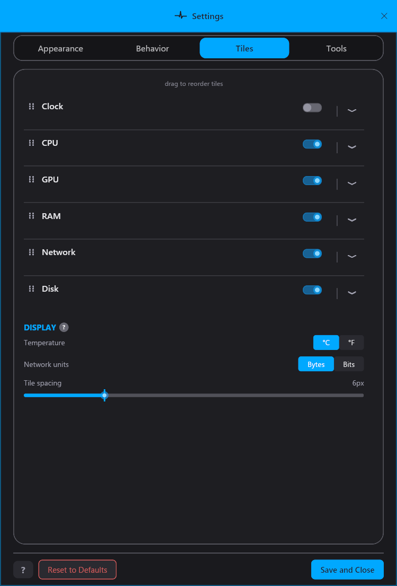
</div>

### Settings, organized

Everything lives in four tabs — **Appearance** (themes, skins, colors, fonts, size, **opacity**), **Behavior** (layout, always-on-top, start-minimized-to-tray, snapping, click-through, **lock position**, reset position, refresh rate), **Tiles** (which tiles show and what each displays, plus the Display/units section), and **Tools** (Alerts, Game Mode, Utilities, Remote).

<div align="center">
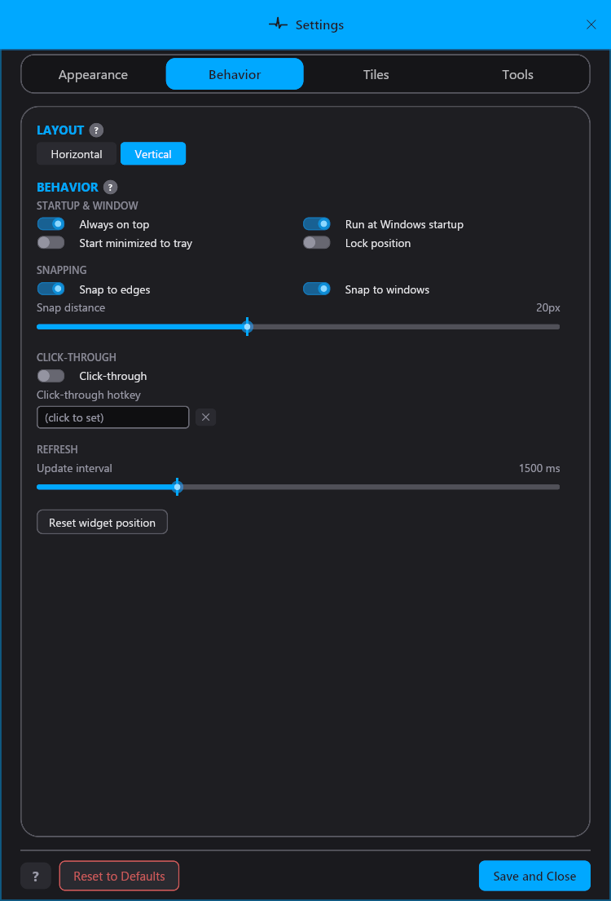
</div>

### Themes, skins, and colors

The appearance engine has three independent layers:

| Layer | What it controls | Count |
|-------|-----------------|-------|
| **Skins** | Shape, borders, tile style, corner radius | 21 built-in |
| **Colors** | 5-color palette (background, tile, accent, text, muted) | 100+ presets |
| **Preset Themes** | One-click skin + color combos | Curated library + downloadable packs |

Hit the  for a random look, undo if you don't like it, and save your favorites to 5 quick slots. Import and export themes as share codes to swap with others, and browse downloadable theme packs from the built-in Theme Store.

<div align="center">

</div>

<div align="center">
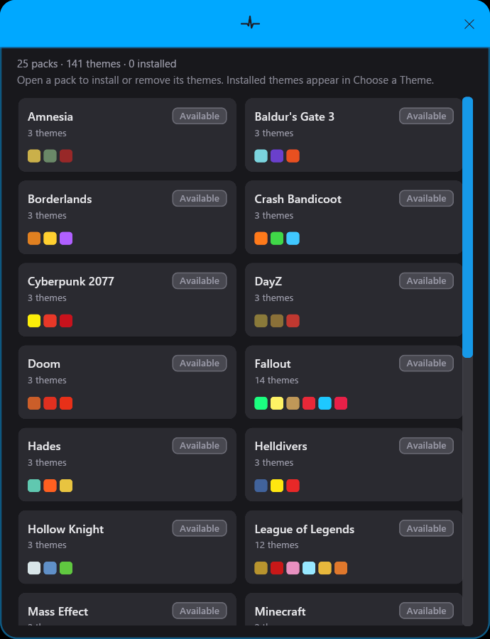
</div>

### Skins

21 built-in skins, from minimal to neon-lit — same data, completely different feel.

<div align="center">
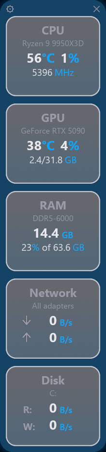
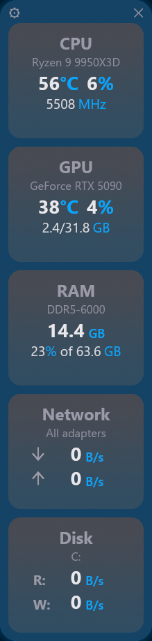
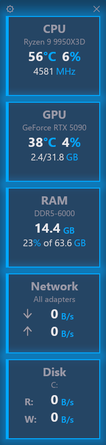

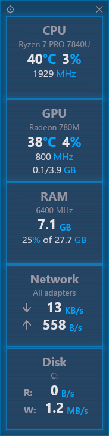
</div>

### Colors

100+ color presets — light or dark, vibrant or muted — plus full control over your own 5-color palette. A sampler of the range, name under each so you can grab the one you like:

<div align="center">
<table>
<tr>
<td align="center">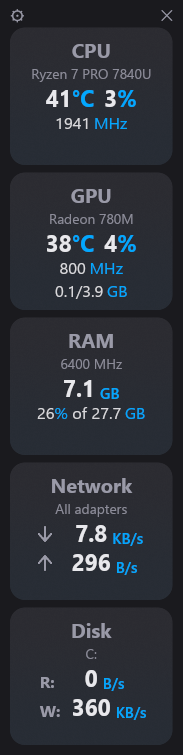</td>
<td align="center">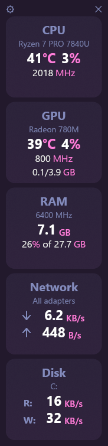</td>
<td align="center">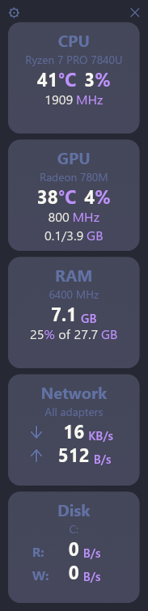</td>
<td align="center">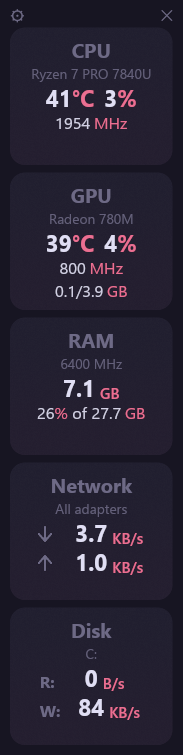</td>
<td align="center">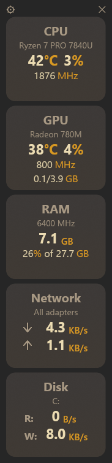</td>
</tr>
<tr>
<td align="center"><b>Dark (default)</b></td>
<td align="center"><b>Synthwave '84</b></td>
<td align="center"><b>Dracula</b></td>
<td align="center"><b>Rosé Pine</b></td>
<td align="center"><b>Gruvbox</b></td>
</tr>
<tr>
<td align="center">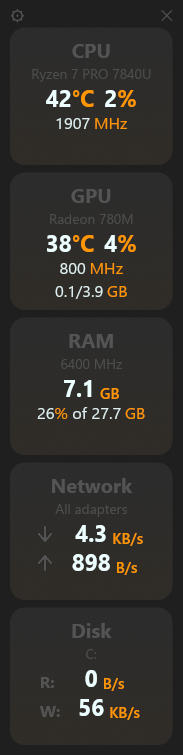</td>
<td align="center">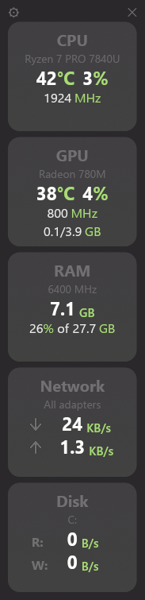</td>
<td align="center">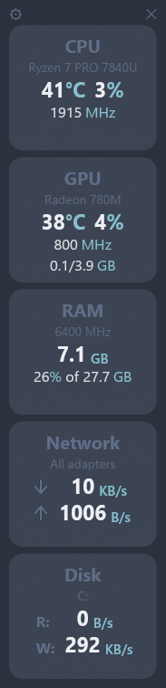</td>
<td align="center">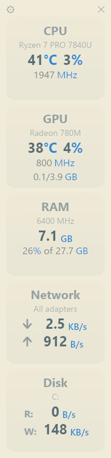</td>
<td align="center">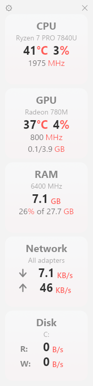</td>
</tr>
<tr>
<td align="center"><b>Material Darker</b></td>
<td align="center"><b>Monokai Pro</b></td>
<td align="center"><b>Nord</b></td>
<td align="center"><b>Solarized Light</b></td>
<td align="center"><b>Snazzy Light</b></td>
</tr>
</table>
</div>

### CPU temperature

A one-time sensor driver setup ([PawnIO](https://pawnio.eu/)) unlocks CPU temperature directly on the widget. The driver is downloaded on demand from the official source — **Flux never bundles or redistributes it**, and you can remove it any time from the same menu. Switch all temperatures between °C and °F from the master **Temperature unit** bar at the top of the Tiles tab.

<div align="center">
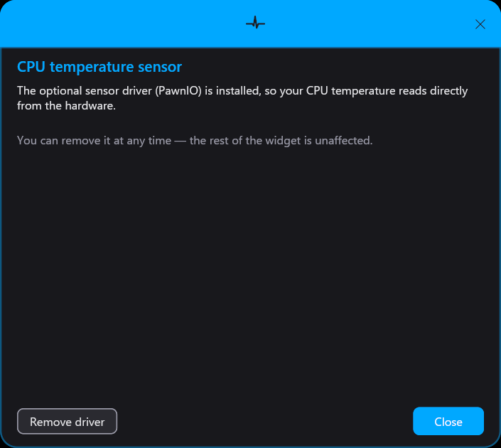
</div>

### Game Mode

Press a hotkey and the widget snaps to a corner of your screen with custom opacity, layout, and tile selection — designed to stay readable but unobtrusive over a game. Press again to send it back. Works in fullscreen.

<div align="center">

</div>

### Alerts

Set a threshold and the widget flashes a warning color when your CPU or GPU runs hot. Or use gradient mode, where the unit text shifts smoothly from a cool start color to a hot color as temperature climbs.

<div align="center">
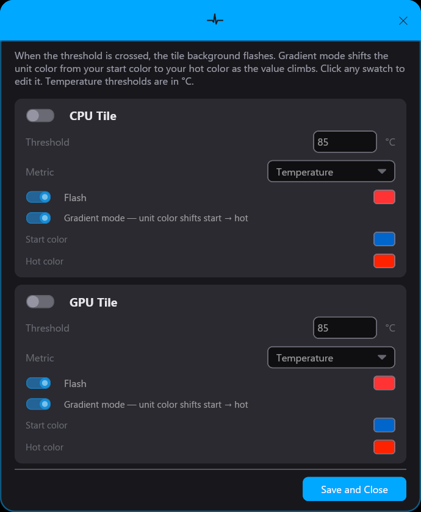
</div>

### Utilities

Quick launchers for popular Windows optimization tools and a window-snap blocklist with a live window picker.

<div align="center">

</div>

### Remote monitoring

Run Flux on multiple machines and watch them all from one desktop. TCP over TLS with mutual handshake-key authentication. Each machine appears as a tab in the widget, with independent layout, theming, and alerts.

<div align="center">

</div>

Switch between machines with the tabs — here a headless server:

<div align="center">
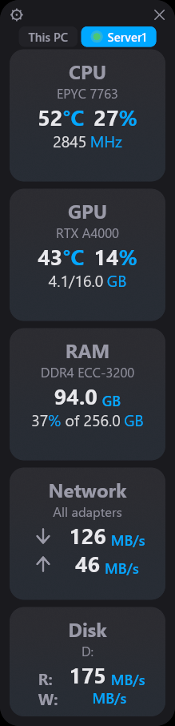
</div>

**Pop devices out like browser tabs.** Drag a device's tab out of the widget, right-click it, or click the **↗** button to give that machine its own always-on-top window — theme-matched, snapping, and fully independent. Drag the window back onto the widget (or close it) to re-dock the tab.

<div align="center">
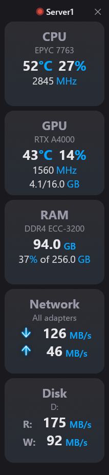
</div>

### Tools & updates

The Tools tab gathers Alerts, Game Mode, Utilities, and the Remote launcher in one place, alongside an Updates panel with the latest changelog.

<div align="center">
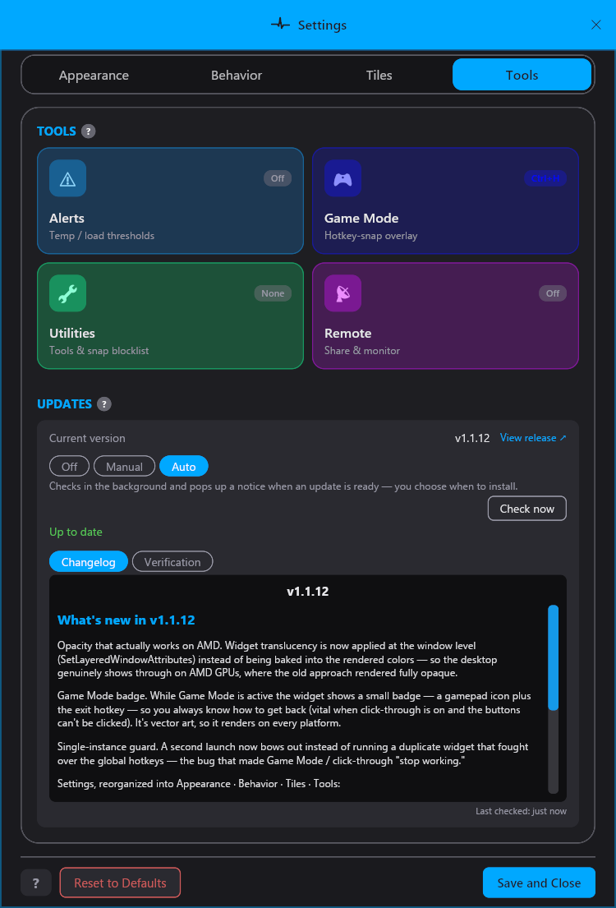
</div>

Updates are never installed silently — you choose **Off**, **Manual**, or **Auto**:

- **Off** — never checks.
- **Manual** — checks in the background and flags the gear with a quiet dot; you install when you like.
- **Auto** — checks in the background and pops up a notice when a new version is ready, with the release notes and a button straight to the Updates panel. It still never installs on its own (no surprise admin prompt), and the notice tells you how to switch it off.

<div align="center">
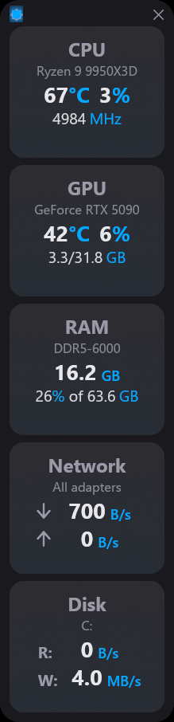

<br>
<sub>Manual flags the gear with a dot; Auto adds a one-click notice.</sub>
</div>

### Quality of life

- **Snap to edges and windows** — the widget docks flush to screen edges and other windows' borders, with a configurable blocklist
- **Click-through mode** — make the widget invisible to the mouse; toggle back with a hotkey
- **Slider default markers** — every settings slider shows a tick at its factory default that glows as you approach it
- **Built-in help** — the **?** button opens a categorized guide to every feature
- **Dark and light mode** — full palette swap with one click
- **Run at startup** — per-user, no admin needed
- **Crash-hardened** — automatic render recovery and crash logging

---

## Security

Flux is built with security-conscious defaults:

- **No telemetry** — the app makes zero analytics calls. The only outbound connections are the optional update check, the optional PawnIO driver download (user-initiated), and LAN-only remote monitoring.
- **PawnIO is never bundled** — the CPU temperature driver is downloaded on demand from its [official GitHub release](https://github.com/namazso/PawnIO.Setup/releases), and is never redistributed here.
- **Verified updates** — the in-app updater refuses to run a downloaded installer unless its SHA-256 matches a checksum published alongside the release.
- **Scanned on VirusTotal** — every release is scanned and the result is linked in its notes. v1.1.15: **[0 / 68](https://www.virustotal.com/gui/file/5fd1121d379de55c4b4fada08708c7f64f4c559b242a29ea2ddfcfc92d2ff7ff)** (clean).
- **Unsigned build** — the installer is not code-signed, so Windows SmartScreen shows a one-time prompt. Verify any download against the `.sha256` published with each release before running it.
- **Settings stay local** — all configuration lives in `%APPDATA%\Flux`. Nothing is sent anywhere.
- **Source-available** — every line is in this repo for inspection (see [License](#license)).

---

## Installation

1. Download the latest **`flux-setup-vX.Y.Z.exe`** from [**Releases**](../../releases).
2. (Recommended) verify it against the published checksum:
   ```powershell
   Get-FileHash .\flux-setup-vX.Y.Z.exe -Algorithm SHA256
   ```
3. Run it. The build is unsigned, so SmartScreen shows a one-time prompt — click **More info → Run anyway**.
4. Follow the wizard: **Just me** (no admin) or **All users**, pick the optional desktop shortcut / startup / launch, and **Install**.

<div align="center">
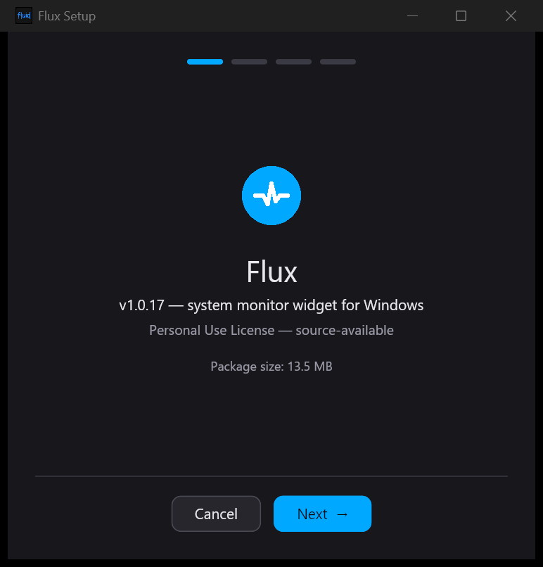
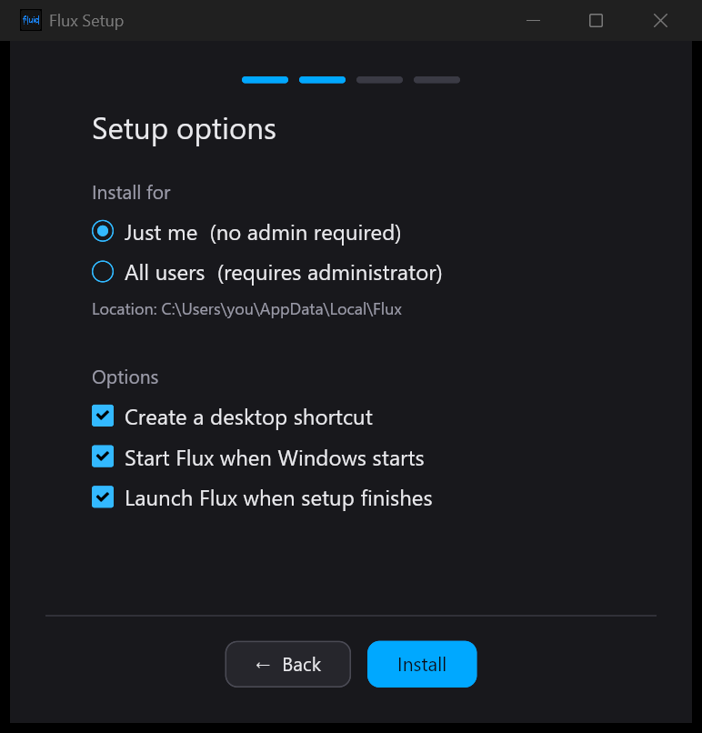
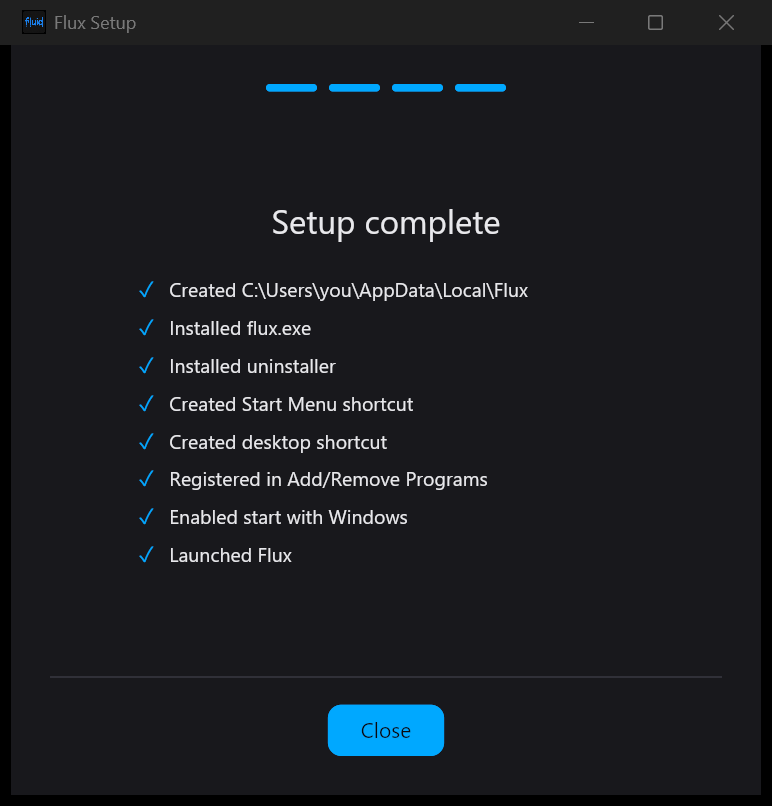
<br>
<sub>The installer: welcome → options → done.</sub>
</div>

The installer is a small, self-contained custom installer that embeds the widget — no separate download, no .NET. It can also run silently for scripted deployments:

```bat
flux-setup.exe /S            :: silent per-user install
flux-setup.exe --help        :: list every switch
```

See [`docs/INSTALLER.md`](docs/INSTALLER.md) for the full command-line reference, install locations, the registry/shortcut layout, and uninstall instructions.

### Requirements

- Windows 10 / 11 (x64)
- A GPU with Direct3D 12, Vulkan, or DX11 support (virtually all modern PCs)

### Uninstall

**Settings → Apps → Flux → Uninstall** (or Control Panel → Programs and Features) opens the same themed wizard as the installer — not a silent wipe. A single checkbox, **on by default**, does a complete removal: your settings/themes/skins in `%APPDATA%\Flux`, the optional CPU-temperature sensor service, and the PawnIO driver Flux installed. Uncheck it to keep your configuration for a future reinstall.

<div align="center">
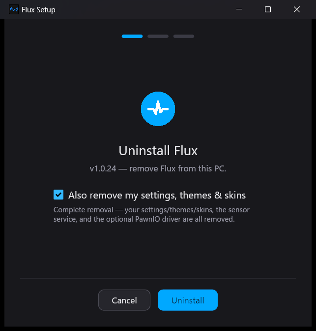
<br>
<sub>One checkbox for a clean, complete removal — no leftovers.</sub>
</div>

For scripted removal, `flux-setup.exe --uninstall /S` runs headless (add `--remove-settings` to also wipe `%APPDATA%\Flux`).

---

## Architecture

Flux is a single executable with no runtime to install. The only optional background component is a small helper service for CPU die-temperature (off unless you turn it on); everything else runs in-process.

```
┌───────────────────────────────────────────┐       TLS (optional)        other
│  Flux  (flux-widget)                    │ ◄───────────────────────►   machines
│  • polls hardware in-process (flux-sensor)│    remote sensor sharing    running
│  • renders tiles on the GPU via iced/wgpu  │                             Flux
└───────────────────────────────────────────┘
```

| Crate | What it is |
|-------|------------|
| `flux-widget` | The widget app (binary `flux`). |
| `flux-sensor` | Hardware polling — sysinfo, NVML for NVIDIA, optional PawnIO for CPU temp. |
| `flux-core` | Shared settings and types. |
| `flux-remote` | Remote-monitoring transport (TLS). |
| `flux-setup` | The self-contained installer (binary `flux-setup`). |

---

## Building from source

Requires a recent stable Rust toolchain on Windows.

```powershell
git clone https://github.com/DruidFluids/Flux.git
cd Flux

# Run the widget directly
cargo run -p flux-widget --release

# Build the widget and the installer
cargo build -p flux-widget -p flux-setup --release
# -> target\release\flux.exe  and  target\release\flux-setup.exe
```

---

## License

**Personal Use License** — © 2026 Matthew Hakes. Source-available, **not** open-source.

You **may** download, build, run, and **modify** Flux for your own use. You **may not** redistribute it — publishing, sharing, mirroring, sublicensing, or selling the software or its source (original or modified, source or binary) requires prior written permission. See [`LICENSE`](LICENSE) for the exact terms.

---

<div align="center">
<sub>Built with Rust, iced, and an unreasonable number of color palettes.</sub>
</div>
